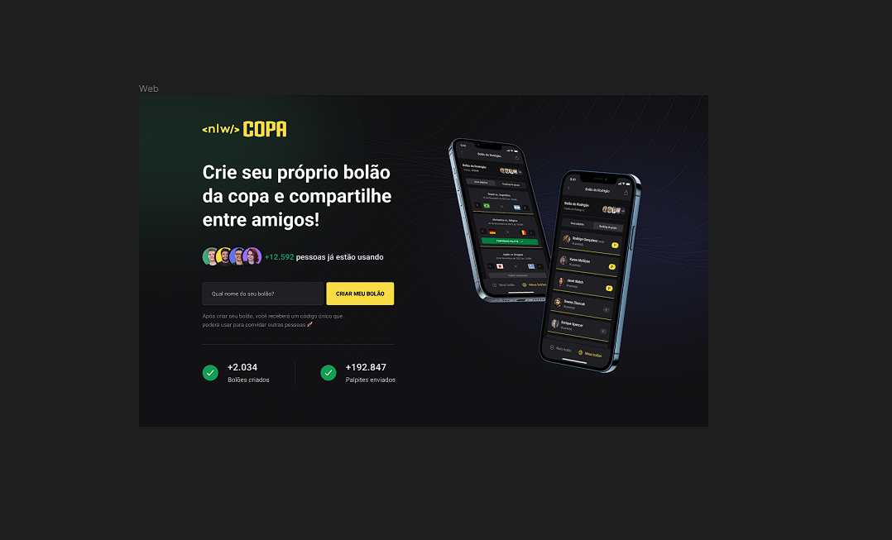
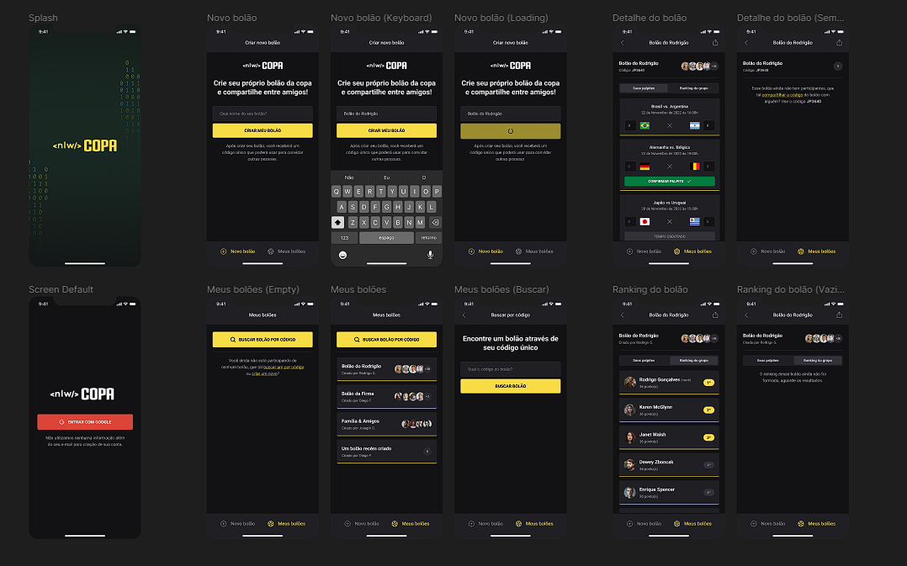
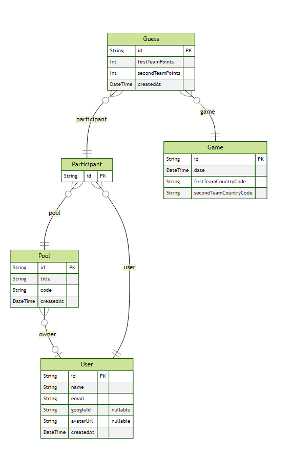

<h1 align="center"> NLW Copa 2022 - Mobile & Web APP </h1>

  <a href="#-tecnologias">Tecnologias</a>&nbsp;&nbsp;&nbsp;|&nbsp;&nbsp;&nbsp;
  <a href="#-projeto">Projeto</a>&nbsp;&nbsp;&nbsp;&nbsp;&nbsp;&nbsp;</a>

 

<h2 align="center"> Web Preview </h2>

  

<h2 align="center"> Mobile Preview</h2>

  

## 🚀 Tecnologias

Esse projeto foi desenvolvido com as seguintes tecnologias:

- 💻 #Web Front end :

- [TypeScript](https://www.typescriptlang.org/)
- [React](https://reactjs.org/)
- [React DOM](https://reactjs.org/)
- [Tailwind](https://tailwindcss.com/)
- [Next.js](https://nextjs.org/)

---

- ⚙️ #Back end :

- [Prisma](https://www.prisma.io/)
- [Node.js](https://nodejs.org/en/)
- [Axios](https://github.com/axios/axios)
- [Zod](https://github.com/colinhacks/zod)
- [Fastify - Cors, JWT](https://www.fastify.io/)
- [Mermaid-js/mermaid-cli (ERD Diagram)](https://github.com/mermaid-js/mermaid-cli)

---

- 📱 #Mobile :

- [React Native](https://reactnative.dev/)
- [React Navigation](https://reactnavigation.org/)
- [Expo](https://expo.dev/)
- [Native base](https://nativebase.io/)
- [Phosphor](https://phosphoricons.com/)
- [Babel/dotenv](https://github.com/brysgo/babel-plugin-inline-dotenv)

## 💻 Projeto

O projeto é um bolão da copa 2022. Onde na Web temos a Landing Page(Front Page) e a capacidade de criar um novo bolão. Já no Mobile, é onde de fato temos o bolão acontecendo.

#### Funcionalidades Mobile:

- Login com Google.
- Criar bolão com nome que quiser, gera um código de 6 caracteres.
- Busca e entrar em um bolão já existente por código.
- Quantas pessoas tem no grupo, (Mosta seu avatar do google).
- Palpitar os jogos da primeira fase da Copa do Mundo 2022 com todos os jogos atualizados com dia e hora.
- Ranking do grupo.

---

Feito com ♥ by Gustavo Batista :wave: [LinkedIn](https://www.linkedin.com/in/gustavo-h-batista/) e [GitHub](https://github.com/gustavohdab)
